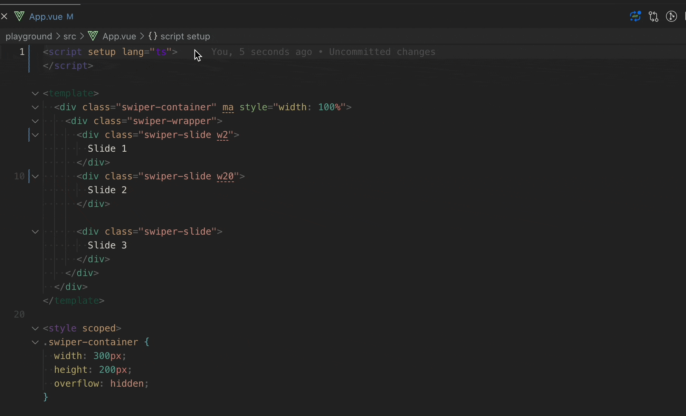

<p align="center">

</p>
<p align="center"> English | <a href="./README_zh.md">简体中文</a></p>

Generate a variety of variable names, the function is similar to CodeIf, and implement a plug-in for direct operation in vscode



## login
1. permanent login
    ```
    # in bashrc or zshrc
    export GenerateNames_Secret=xxxx
    export GenerateNames_Appid=xxxx
    ```

2. enter when vscode activates

>[Apply for Baidu apk](http://api.fanyi.baidu.com/manage/developer)

## :coffee:

[buy me a cup of coffee](https://github.com/Simon-He95/sponsor)

## License

[MIT](./license)
